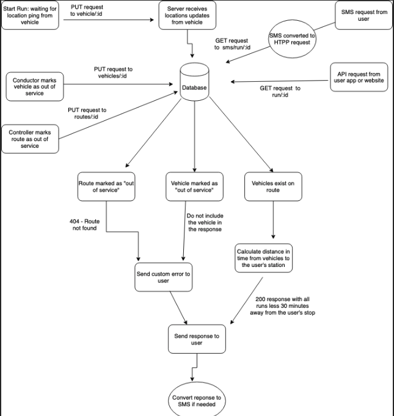
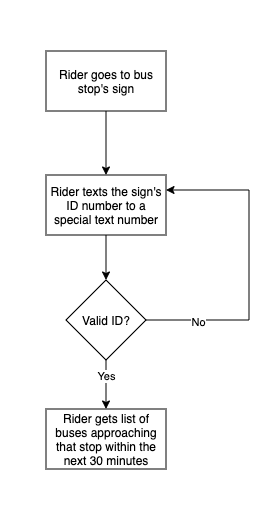
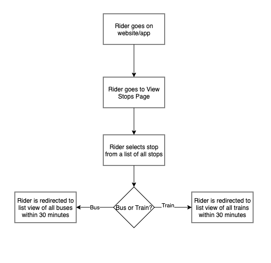
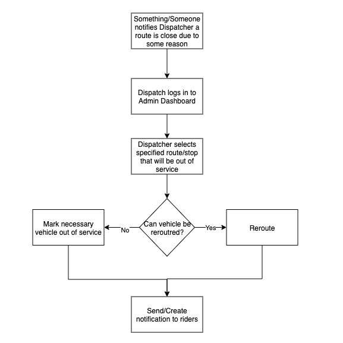
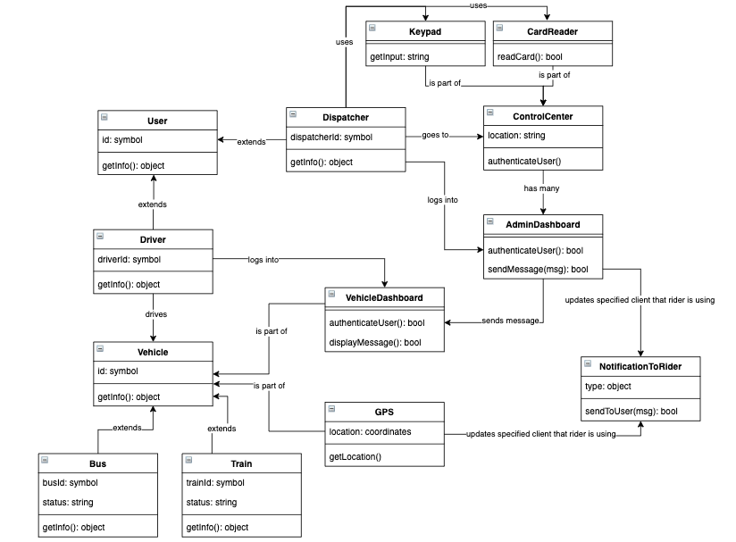

# Design a Public Transit Tracker

OOP Design is a good exercise on how to split up our system into different components. It's like React Components before they were cool but instead of React Components, we separate our system into different objects/classes. The main difficulty with problems like these are that they are opened ended and force you to think abstractly and creatively. One of the other main goals of this exercise is to be able to draw out diagrams to help with communicating abstract ideas before they are implemented in code. These problems are language agnostic.

## Learning Objective
* To understand and design activity diagrams and class diagrams.

## The prompt

A major city has finally realized how beneficial it would be for it's citizens to be able to track public transit and see how far away their next ride is! Luckily for you, the city has placed you in charge of designing the system!

### The mayor's requirement

- Consumers needs to be able to get information about the location of the buses and trains in relation to which stop they request via SMS text message and via a website. They both communicate with the API indicated below.

### Information the mayor has given us

- Each bus/subway train has a GPS tracker on it that will automatically send an HTTP request every minute with configurable data to the database. 
- Our system is able to send SMS messages with a single function call by first converting the SMS to an HTTP request, waiting for a response from the server, and then converting the response back to an SMS text message. 
- Each run has a specific id associated with it, which includes information the vehicle and the route that the vehicle is completing. (ie. #8528 is a specific vehicle completing a Blue Line run)

### Task

Think through and diagram the different components of this public transport tracker including:

- Activity Diagrams (User Stories) OR
- System Data Flow Diagram (Can be a substitute for the Activity Diagrams)
- Class Diagram

If we have time:

- Schema Diagram

Focus should be on the first 2 and if time is willing, go through the next 2. NOTE: *The Data Flow Diagram would be acceptable as well for the user stories because it shows how all the user stories are connected.*

We can assume that the public transit system is made up of buses and subway/trains only. You have access to the following routes:

     GET /:stopID
        request body: {route: xxx, stopId: xxx, include active runs on that route where distance in time from stop < 30   mins }
        response body: {buses that meet the criteria and remaining minutes until they reach the stop}
        
        *if the request is coming from an SMS text message, it will first be converted into an HTTP request
         
     PUT /routes / id
       request body: {route: req.params.id, status: out of service}
     
     PUT vehicle/ id
      request body: {vehicle: req.params.id, status: out of service}

## INTERVIEWER TIPS

There are several edge cases and challenges that your interviewee should consider. Here are some questions that you can ask to help them along that process:

- What are the "nouns" associated with this system? (parts of the system)
- What are the "verbs" associated with this sytem? (actions)
- What happens when a bus/train needs to re-route, skip a stop, or if the route is out of service?
- How is this different from designing something like Venmo? (The main stakeholders or users are just people making payments to each other, as opposed to the many different stakeholders of this system [drivers, dispatches, users])

If your interviewee is stuck, start by discussing the nouns and verbs listed below, and then talk through the user stories listed below.

## SOLUTION

**Nouns:**

- Routes
- Vehicle (bus or traincar)
- Runs (ie #4567 would be a specific vehicle completing a route)
- Stops
- GPS locator on each vehicle

**Verbs:**

- Start run - info needed: vehicle, route, and run number
- Location and time updated once per minute 
- Calculate distance in time to the next stop - if the time is less than 1 minute, display "due" instead
- Handling changes in service, such as:
  - delays
  - express routes in which vehicles skip stops
  - Vehicle breaks down and is now out of service 
  - ReRoute - a run has to take a different route due to construction, etc

### User Stories (Activity Diagrams)

The Data Flow Diagram would be acceptable as a substitute to all the individual user stories as it is a combination of all the user stories in one functioning system.

#### Data Flow Diagram

#### Individual User Stories (Use these if they candidate is really stuck)

If the candidate is really stuck, then the individual stories would be best suited to help them along.

Diagrams as well as written stories of those diagrams are below.

*Users:*

1. **SMS Text Request:** Each bus stop has a sign with information about which buses stop there, what time routes run, a bus stop id number, and phone number that users can text to receive information about which buses are scheduled to arrive within the next 30 minutes. The user will send a text to the number listed on the sign with a 4 digit code specific to the bus stop that they would like to receive information about. The user receives an SMS response with the list of buses approaching that stop within in the next 30 minutes.

2. **Transit Tracker App or Website:** The user has an app on their phone or is using a website to view a list of upcoming buses or trains that are approaching. The user navigates to a "View Stops" page and selects their stop from a list of all stops. The user is redirected to a list view of all approaching buses or trains within the next 30 minutes. Each bus/train listed has information about which direction it's headed, as well as how many minutes until it arrives at the stop.

*System Admins:*

3.**All vehicles on a route are re-routed due to construction:** The system administrator is notified that a route will be closed due to construction, which means that any bus/trains that normally use that route will have to be re-routed(aka assigned a new route). The system administrator navigates to that vehicle and clicks the "out of service" button. The system admin can select which route the buses/trains will be re-routed to.

4.**A bus/train has broken down, and is no longer in service:** The conductor or drive realizes that the vehicle cannot operate anymore, and notifies the control center that the vehicle cannot complete the route. The system administrator uses the admin portal to navigate to the specific run, and clicks the "out of service" button, which removes the vehicle from service.

### Class Diagram Guidance

Use the nouns and verbs to help the candidate with this. The important parts of the class diagram are:

- Users
  - Driver extends Users
  - Dispatcher extends Users
    - Reason: We want to talk about how to use inheritance here to have a base class and subclasses of that base class
- Vehicle
  - VehicleDashboard is part of Vehicle
  - GPS is part of Vehicle
    - Reason for above two: We want to talk about object composition. If we extended GPS from Vehicle, it would cause tight coupling of things that are best composed since while they are related, a GPS (or Vehicle Dashboard) is not a "version" of a Vehicle. It is just a part of it.
  - Train extends Vehicle
  - Bus extends Vehicle
    - Reason for above two: Same reason as the Dispatcher and Driver extending Users
- Admin Dashboard
- NotificationToRider

### Class Diagram

## Below is if we have time

### DB Schema

- The main thing to talk about here is the many-to-many relationship between vehicles and routes and how the schedule/runs data are not exclusive to either vehciles or routes but are associated with both so that info goes in that thru table.
- The main associations are:
  - Vehicles and Routes have a many-to-many relationship with each other thru Runs
  - Routes and Stops have a many-to-many relationship with each other through the RouteStops thru table

## Resources
* [Sample Slides](https://docs.google.com/presentation/d/1847iTV1x67_qs5goM6GD4Gtm4soLLGwBUvJdMhe0zsA/edit?usp=sharing)
